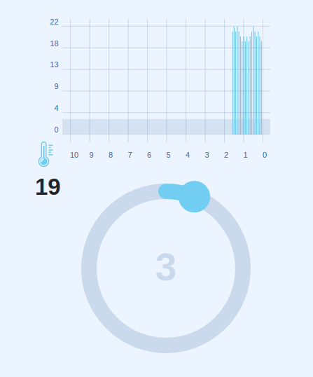

# TRAINING CASE: Alarm threshold graph

## Stack:

- TypeScript
- React
- Redux
- Saga
- Jest
- Prototypes

## Sources of:

- [React Redux + Saga. Практический Курс](https://www.youtube.com/watch?v=G3GGXIhggGs)
- [Redux-Saga React Полный Курс. Саги, Эффекты, Генераторы.](https://www.youtube.com/watch?v=ah5voE_SGjo)
